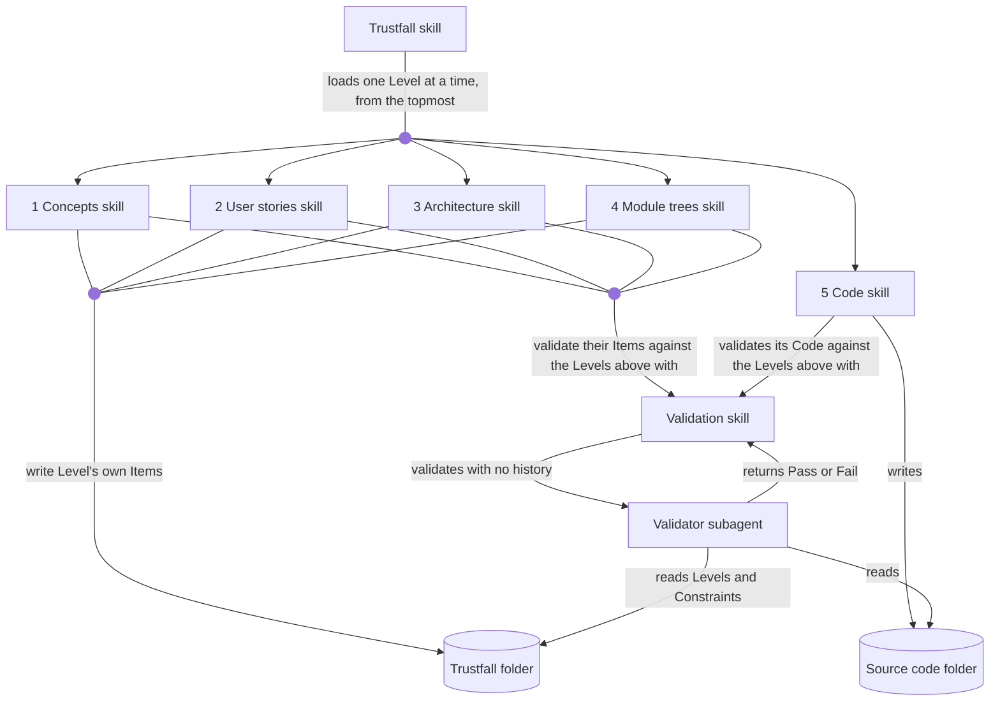

# Architecture

```mermaid
flowchart TD
  trustfall[Trustfall skill]
  load@{ shape: f-circ }
  concepts[1 Concepts skill]
  stories[2 User stories skill]
  architecture[3 Architecture skill]
  modules[4 Module trees skill]
  code[5 Code skill]
  write@{ shape: f-circ }
  check@{ shape: f-circ }
  validation[Validation skill]
  levels[(Trustfall folder)]
  source[(Source code folder)]
  subagent[Validator subagent]
  trustfall -- loads one Level at a time, from the topmost --- load
  load --> concepts & stories & architecture & modules & code
  concepts & stories & architecture & modules --- write
  write -- write Level's own Items --> levels
  %%code -- reads all the Levels --> levels
  code -- writes --> source
  concepts & stories & architecture & modules --- check
  check -- validate their Items against the Levels above with --> validation
  code -- validates its Code against the Levels above with --> validation
  validation -- validates with no history --> subagent
  subagent -- reads Levels and Constraints --> levels
  subagent -- reads --> source
  subagent -- returns Pass or Fail --> validation
```
