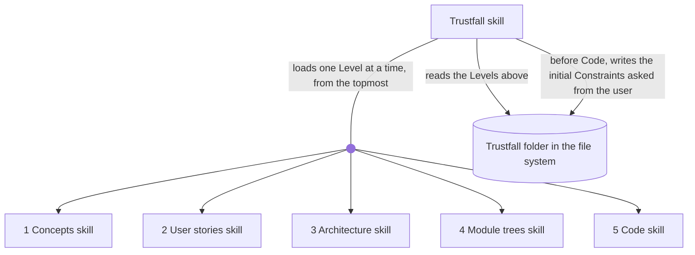
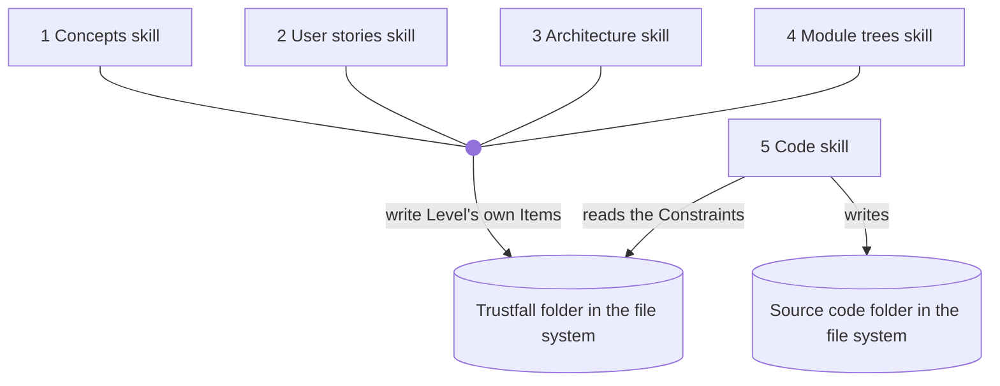
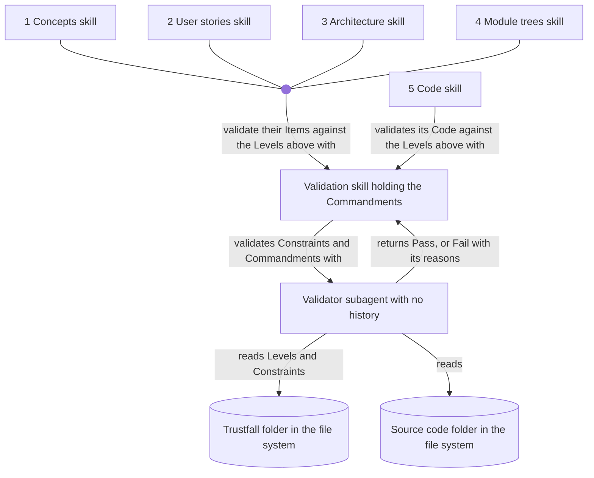

# Architecture

```mermaid
flowchart TD
  trustfall[Trustfall skill]
  load@{ shape: f-circ }
  concepts[1 Concepts skill]
  stories[2 User stories skill]
  architecture[3 Architecture skill]
  modules[4 Module trees skill]
  code[5 Code skill]
  levels[(Trustfall folder in the file system)]
  trustfall -- loads one Level at a time, from the topmost --- load
  load --> concepts & stories & architecture & modules & code
  trustfall -- reads the Levels above --> levels
  trustfall -- before Code, writes the initial Constraints asked from the user --> levels
```

```mermaid
flowchart TD
  concepts[1 Concepts skill]
  stories[2 User stories skill]
  architecture[3 Architecture skill]
  modules[4 Module trees skill]
  code[5 Code skill]
  write@{ shape: f-circ }
  levels[(Trustfall folder in the file system)]
  source[(Source code folder in the file system)]
  concepts & stories & architecture & modules --- write
  write -- write Level's own Items --> levels
  code -- reads the Constraints --> levels
  code -- writes --> source
```

```mermaid
flowchart TD
  concepts[1 Concepts skill]
  stories[2 User stories skill]
  architecture[3 Architecture skill]
  modules[4 Module trees skill]
  code[5 Code skill]
  check@{ shape: f-circ }
  validation[Validation skill holding the Commandments]
  subagent[Validator subagent with no history]
  levels[(Trustfall folder in the file system)]
  source[(Source code folder in the file system)]
  concepts & stories & architecture & modules --- check
  check -- validate their Items against the Levels above with --> validation
  code -- validates its Code against the Levels above with --> validation
  validation -- validates Constraints and Commandments with --> subagent
  subagent -- reads Levels and Constraints --> levels
  subagent -- reads --> source
  subagent -- returns Pass, or Fail with its reasons --> validation
```
