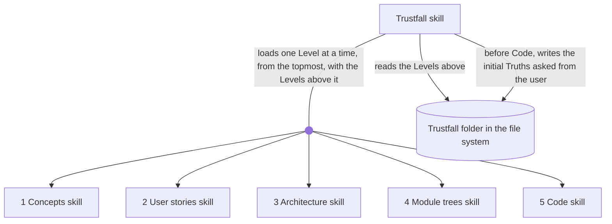
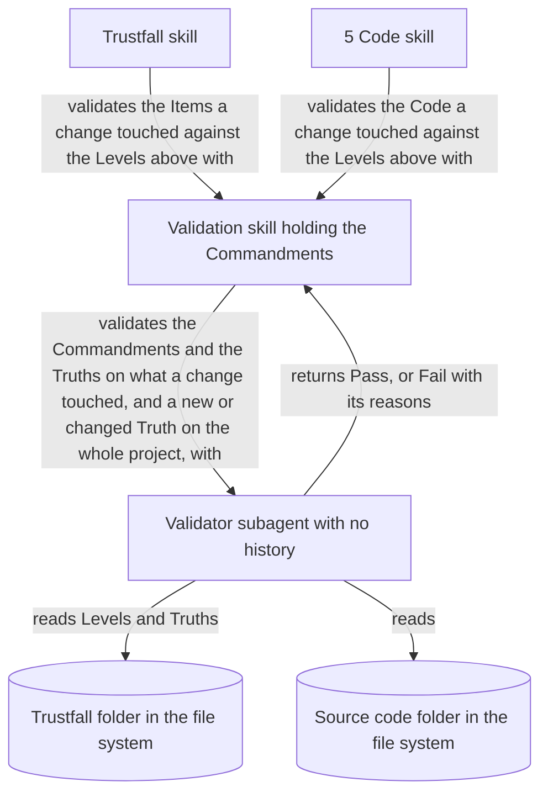

# Architecture

## Loading the Levels

```mermaid
flowchart TD
  trustfall[Trustfall skill]
  load@{ shape: f-circ }
  concepts[1 Concepts skill]
  stories[2 User stories skill]
  architecture[3 Architecture skill]
  modules[4 Module trees skill]
  code[5 Code skill]
  levels[(Trustfall folder in the file system)]
  trustfall -- loads one Level at a time, from the topmost, with the Levels above it --- load
  load --> concepts & stories & architecture & modules & code
  trustfall -- reads the Levels above --> levels
  trustfall -- before Code, writes the initial Truths asked from the user --> levels
```

## Writing Items and Code

```mermaid
flowchart TD
  trustfall[Trustfall skill]
  code[5 Code skill]
  levels[(Trustfall folder in the file system)]
  source[(Source code folder in the file system)]
  trustfall -- writes the current Level's Items --> levels
  code -- reads the Truths --> levels
  code -- writes --> source
```

## Validating

```mermaid
flowchart TD
  trustfall[Trustfall skill]
  code[5 Code skill]
  validation[Validation skill holding the Commandments]
  subagent[Validator subagent with no history]
  levels[(Trustfall folder in the file system)]
  source[(Source code folder in the file system)]
  trustfall -- validates the Items a change touched against the Levels above with --> validation
  code -- validates the Code a change touched against the Levels above with --> validation
  validation -- validates the Commandments and the Truths on what a change touched, and a new or changed Truth on the whole project, with --> subagent
  subagent -- reads Levels and Truths --> levels
  subagent -- reads --> source
  subagent -- returns Pass, or Fail with its reasons --> validation
```
